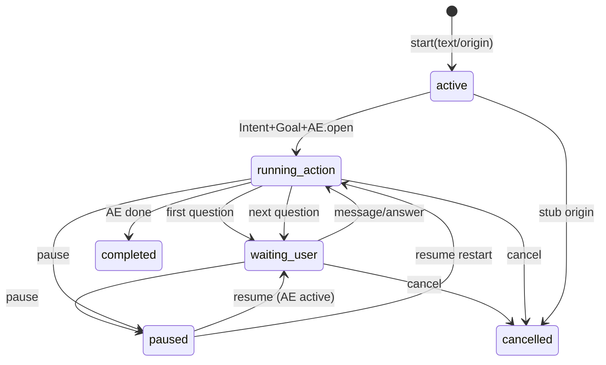

# Conversation Engine — Orchestration

## Lifecycle

## Start path

1. Reject / stub: email|whatsapp|open_banking → honest stub session, no route.
2. Optional resume if `suggestion_id` already linked.
3. **IntentAdapter.classify** (deterministic; LLM only if Intent engine configured to use it).
4. Build `known_slots` from entities + context.
5. Persist ConversationSession; **ActionAdapter.open_from_text** with precomputed intent + known_slots.
6. **GoalAdapter.shadow_from_intent** (idempotent key `ce:{ces_id}:{intent}`).
7. Collect project/calendar/maps/brain artifacts via adapters.
8. Return `{ route: /action/{ae_id}, ui_mode: action_engine, first_question }` — FE navigates to AE chip UI.

## Message path

User answer → CE history → AE.answer → sync slots/artifacts/status → next question or completed.

## Resume path

By `session_id` or `resume_token`. If AE still `active`, restore waiting_user + route. Else restart orchestration with preserved `known_slots`.

## Synthetic replies

Short ORA lines only (`synthetic_prompt_for_intent`) — never essays. UI shows AE questions, not a chat transcript.

## Proactive

Interrupted study/travel CE sessions → suggestion “Ieri hai interrotto…” / “Stavi organizzando…” with action **Riprendi** → Accept → CE resume.

## Home

- Top: **PARLA CON ORA**
- Resume card: Continua (never Apri chat)
- Pipeline closes when AE completes → Home refresh shows project / plan / next focus
